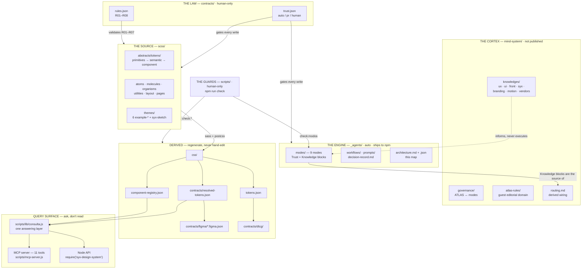
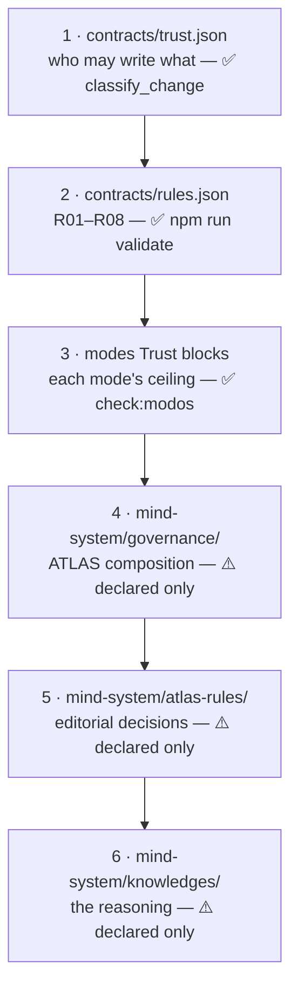
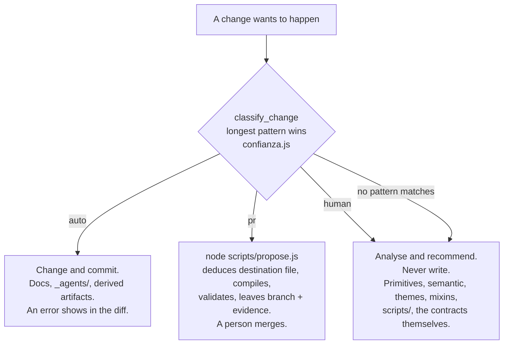
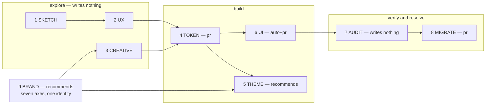
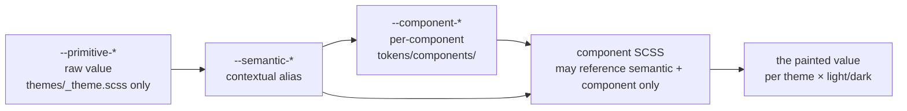

# SYX — Architecture Map

The ecosystem as diagrams-as-code. The same graph, machine-readable, is
[`_agents/architecture.json`](architecture.json) — one file to parse, one to look at.
Both **describe and never authorise**: every box cites its source of truth, and when map
and source disagree, the source wins and the map is what needs fixing. Keep both in the
same change that alters the shape they describe (tier `auto`).

---

## 1. The whole ecosystem — layers and flows

Sources: `contracts/trust.json`, `contracts/rules.json`, `package.json` scripts,
`scripts/lib/consulta.js`. Inventory counts live in the generated files
(`component-registry.json`, `tokens.json`), on purpose — see `architecture.json → inventory`.

---

## 2. Precedence — who wins an argument

Higher rung wins, no exceptions by context. A knowledge module that recommends what R01
forbids is a module that needs fixing. `[ATLAS]:` operates at rung 5 authority and never
above. Rungs 4–6 are today **declared only**: no guard checks them (guard B, specified in
`ACOPLE.md`, would cover the mode↔routing wiring).

---

## 3. Trust — what happens when something wants to write

Source: `contracts/trust.json` (path lists live there, not here). The direction of the
boundary is the cascade: the higher a file sits, the more places a change reaches.
Note for map-readers: the `*.md` pattern matches markdown **at any depth**, which is why
`ACOPLE.md` proposes naming `governance/`, `atlas-rules/`, `constitution.md` explicitly
as `human` — documentation that is also law should not inherit `auto` for being markdown.

---

## 4. Modes — nine lenses and how they compose

Grammar: `→` pipeline (each output feeds the next), `+` evaluative (same artifact),
**`+` binds before `→`**. Valid and invalid combinations: `mind-system/routing.md`.
The tier measures interrogating the *system*, not loading the *cortex* — two axes, never
summed. A mode grants no permission: `check:modos` compares every Trust block against
`contracts/trust.json` and keeps the three mode indices (`CLAUDE.md`, `AGENTS.md`,
`_agents/modes/README.md`) listing the same modes that exist on disk.

---

## 5. Tokens — the cascade a value travels

R01 enforces the arrow you must not skip: no `--primitive-*` in component files.
`get_token` answers with the value the browser paints, alias chain included;
`find_token_by_value` answers before you hardcode one. Where a **new** component token
goes is *deduced from its family* by `confianza.js destinoDeToken()` — no lookup table
to rot.

---

## 6. Guards — what `npm run check` actually chains

```mermaid
flowchart TB
    CHECK["npm run check"] --> V["validate — R01–R04 errors,<br/>R05–R07 warnings"]
    CHECK --> T1["check:themes — symmetry across 7 themes"]
    CHECK --> T2["check:version — version citations"]
    CHECK --> T3["check:tokens — snapshot sync"]
    CHECK --> T4["check:huerfanos — orphans"]
    CHECK --> T5["check:registry — registry vs compiled CSS"]
    CHECK --> T6["check:mcp — server smoke test"]
    CHECK --> T7["check:escaner — the scanner itself"]
    CHECK --> T8["check:figma — export sync"]
    CHECK --> T9["check:mixins — mixin docs vs code"]
    CHECK --> T10["check:modos — Trust blocks vs contract"]
    CHECK --> T11["check:encoding — no mojibake"]
    CHECK --> T12["check:package — npm pack contents"]
    CHECK --> B["build — the compile is itself a check"]
```

Source: `package.json` scripts. `prepublishOnly` adds `check:consumible`.
**Known unguarded seams** (as of this map): rungs 4–6 of the ladder; the mode↔routing
wiring (guard B pending); the npm package's self-containment against `mind-system/`
references; R08 (declared in `rules.json`, implemented nowhere yet).

---

## How to keep this map honest

- Add a mode → it appears in §4, in `architecture.json → modes.list`, and in the three
  indices `check:modos` already watches.
- Add a generator or a guard → one edge in §1/§6 and one entry in
  `architecture.json → edges / guards.map`.
- Add a knowledge domain → §1's cortex box and the mode's Knowledge block;
  `routing.md` follows the block, and this map follows `routing.md`.
- Never copy an inventory number into this file. Point at the file that generates it.
